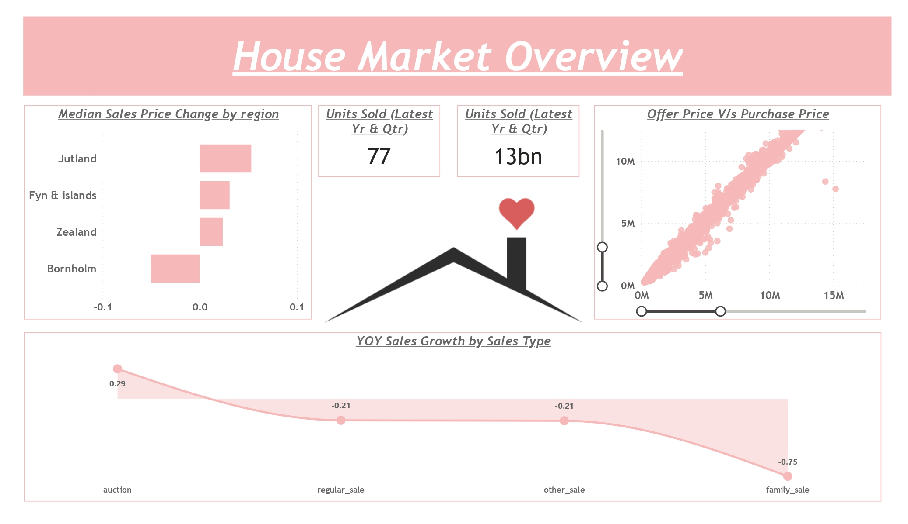
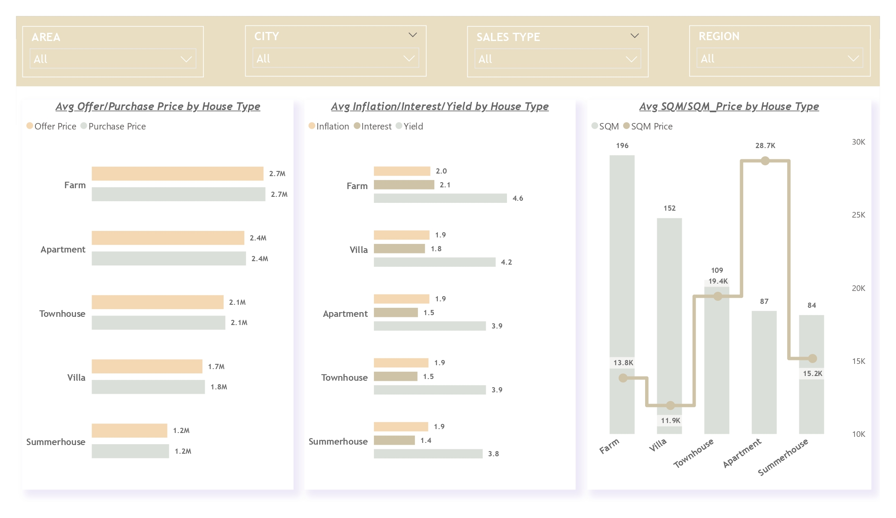
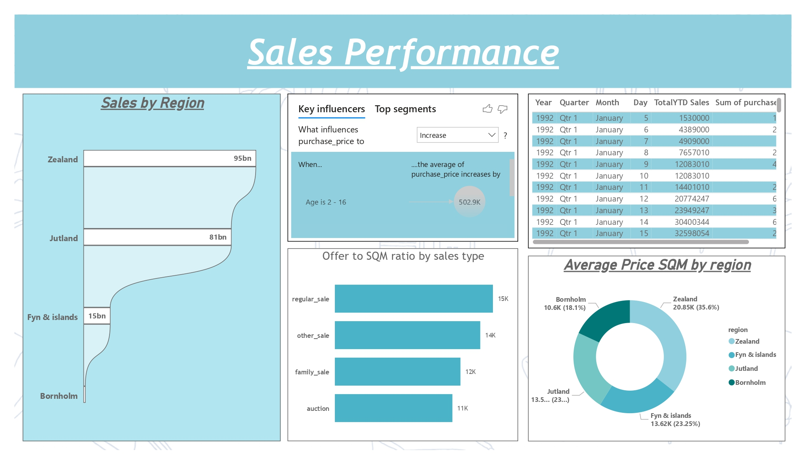

# 🏠 House Price Analysis — Power BI Dashboard


An end-to-end business intelligence project analyzing residential housing market trends using **Power BI**, **DAX**, and **MySQL**. The dashboard delivers actionable insights into pricing patterns, property characteristics, and market dynamics to support data-driven real estate decisions.

---

## 📊 Dashboard Preview

| Overview | Price Trends | Sales Performance |
|----------|-------------|-----------------|
|  |  |  |

> 📄 Full dashboard also available as [Final Dashboard.pdf](Final%20Dashboard.pdf)

---

## 🎯 Project Objectives

- Analyze house price distributions across locations, property types, and time periods
- Identify key drivers of housing prices (size, condition, features, geography)
- Build interactive visualizations for real estate market exploration
- Demonstrate end-to-end BI workflow: data extraction → transformation → modeling → visualization

---

## 📁 Repository Structure

```
House-Price-Analysis/
│
├── House Price Analysis.pbix       # Power BI report file
├── Final Dashboard.pdf             # Exported dashboard (PDF)
│
├── Housing Data.csv                # Primary dataset
├── Housing_Data_Definitions.xlsx   # Data dictionary / field definitions
│
├── DAX Formula.docx                # All DAX measures and calculated columns
├── MYSQL Script.docx               # SQL queries used for data extraction
├── House Price Analysis.docx       # Project documentation / write-up
│
├── 1.png                           # Dashboard screenshot – Page 1
├── 2.png                           # Dashboard screenshot – Page 2
└── 3.png                           # Dashboard screenshot – Page 3
```

---

## 🔧 Tools & Technologies

| Tool | Purpose |
|------|---------|
| **Power BI Desktop** | Dashboard design, data modeling, and visualization |
| **DAX (Data Analysis Expressions)** | Custom measures, KPIs, and calculated columns |
| **MySQL** | Data extraction and preprocessing via SQL queries |
| **Microsoft Excel** | Data dictionary and field definitions |
| **CSV** | Raw housing dataset |

---

## 📐 DAX Measures Highlights

Custom DAX measures were developed to support dynamic analysis. Key measures include:

- **Average Sale Price** — overall and filtered by property attributes
- **Price per Square Foot** — normalized pricing metric across property sizes
- **Year-over-Year Price Change (%)** — trend analysis across time periods
- **Median House Price** — robust central tendency measure
- **Price Band Classification** — segmentation of properties into price tiers

> Full DAX formulas documented in [`DAX Formula.docx`](DAX%20Formula.docx)

---

## 🗄️ Data Source & Schema

**Dataset:** `Housing Data.csv`  
**Field Reference:** `Housing_Data_Definitions.xlsx`

Key fields include (refer to data dictionary for full definitions):

| Field | Description |
|-------|-------------|
| Sale Price | Transaction price of the property |
| Square Footage | Total living area (sq ft) |
| Bedrooms / Bathrooms | Room counts |
| Year Built | Construction year |
| Location / Zip Code | Geographic identifiers |
| Condition / Grade | Property quality ratings |
| Lot Size | Total lot area |

---

## 🗃️ MySQL Data Extraction

SQL scripts were used to query and preprocess the housing dataset prior to loading into Power BI.

> Full SQL scripts documented in [`MYSQL Script.docx`](MYSQL%20Script.docx)

---

## 📈 Key Insights

- **Location** is the strongest predictor of house prices, with significant variation across zip codes
- **Square footage** shows a strong positive correlation with sale price
- **Properties with higher condition and grade ratings** command a measurable price premium
- **Year built** affects pricing, with newer and fully renovated properties trending above median
- **Price per square foot** analysis reveals hidden value pockets in specific neighborhoods

---

## 🚀 How to Use

1. **Clone the repository**
   ```bash
   git clone https://github.com/Munkh976/House-Price-Analysis.git
   ```

2. **Open the report**
   - Open `House Price Analysis.pbix` in **Power BI Desktop** (free download at [powerbi.microsoft.com](https://powerbi.microsoft.com))

3. **Explore the data**
   - Interact with slicers to filter by location, price range, property type, and year
   - Hover over visuals for detailed tooltips
   - Use drill-through pages for granular analysis

4. **Review documentation**
   - `House Price Analysis.docx` — full project write-up
   - `DAX Formula.docx` — all custom measures explained
   - `MYSQL Script.docx` — data extraction logic

---

## 👤 Author

**Munkhkhishig Banzragch**  
MS in Data Science Candidate — Western Michigan University  
📧 munkh.mn@gmail.com  
🔗 [LinkedIn](https://www.linkedin.com/in/munkh-banz/) | [GitHub](https://github.com/Munkh976)

---

## 📄 License

This project is for educational and portfolio purposes. Dataset used for academic analysis only.
